# Tessera

Reverse engineering for legacy systems. Connect a Git repository and generate a **versioned knowledge graph** of its architecture — Markdown knowledge nodes, linked by a **Merkle DAG** for incremental processing and reliable queries.

## Core idea

```
GitHub (push) → Worker → clone → tree-sitter (static AST, zero cost)
                                 ↓
                 only nodes whose structuralHash changed → semantic AI
                                 ↓
                 markdown knowledge nodes + semanticHash
                                 ↓
                 Merkle DAG → snapshot per commit (content-addressed)
                                 ↓
                 query layer: "what breaks if I change X?", diff, chat
```

- **Hybrid**: the AST is the ground truth (confidence ~1.0). AI only summarizes and infers semantics — it never decides structure.
- **Two hashes per node**: `structuralHash` (normalized AST, changes on structural changes) and `semanticHash` (content + child hashes, propagates in cascade).
- **Incremental**: 5 files changed → AI processes 5 nodes, not the monolith.
- **Time-travel**: immutable snapshot per commit; queries carry a version.

## Features

### 1. Sign in

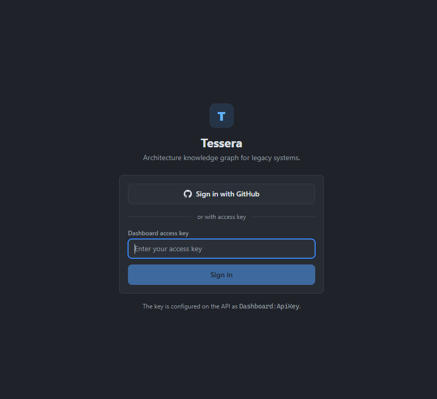

Sign in with a dashboard API key or **Sign in with GitHub**. GitHub OAuth also scopes access per user: admins (from `AUTH_ADMINS`) see every repository, other users see only the repositories their installations cover.

### 2. Dashboard

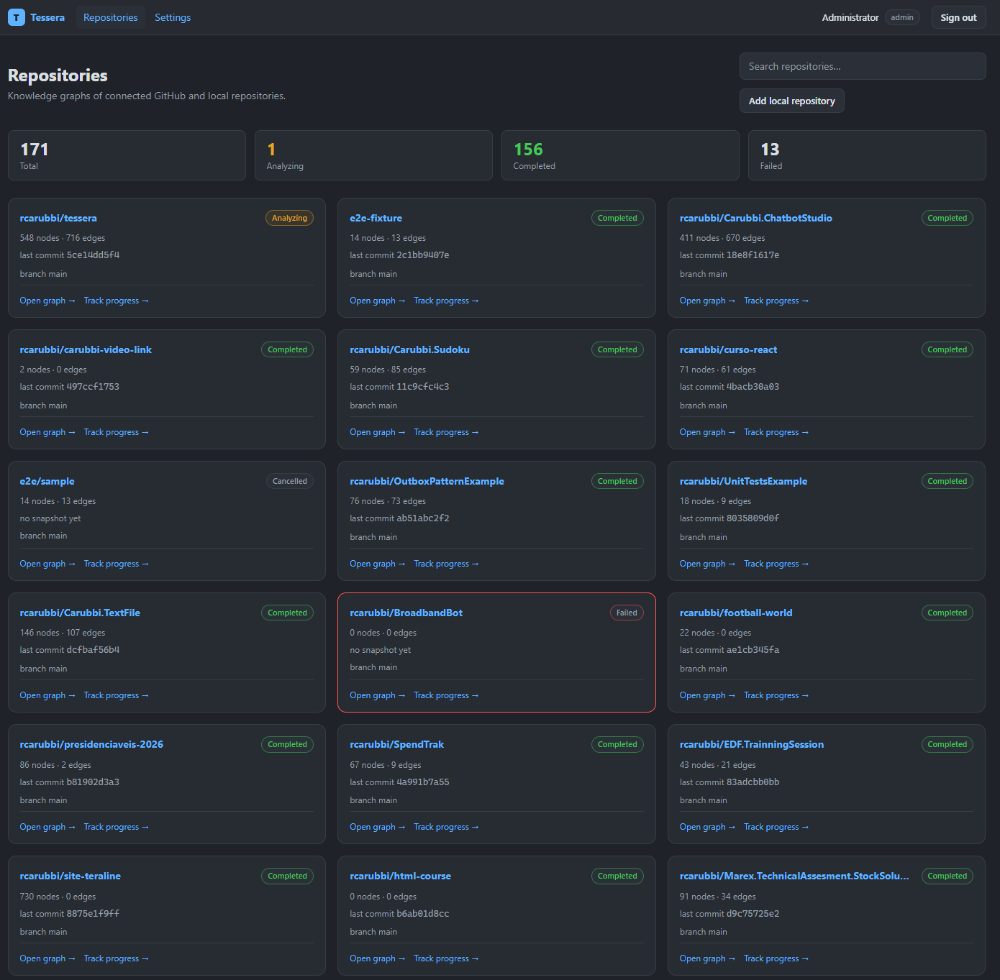

The dashboard lists all connected repositories with their analysis status, branch, last snapshot and a per-repo card. Connect a GitHub repo, add a **local repository**, and jump straight into each repo's graph, diff, chat and review tools.

### 3. Analysis monitoring

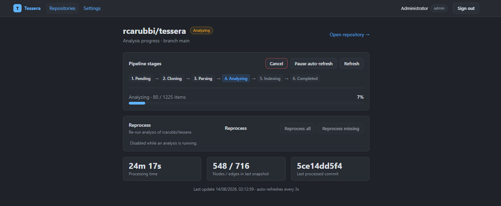

Follow the pipeline stage by stage — clone → parse → AI analysis → index → snapshot — with live progress, per-stage counters and cancellation. **Reprocess** controls re-queue a full or incremental run at any time.

### 4. Interactive knowledge graph

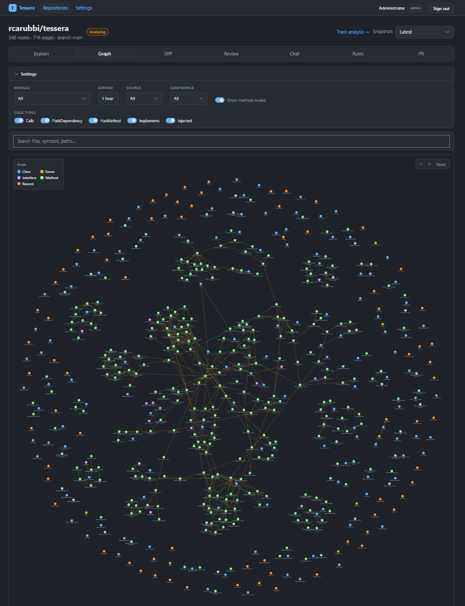

The architecture graph visualizes classes, interfaces, methods and functions as nodes linked by typed edges (Inherits, Implements, Calls, HasMethod, FieldDependency, Injected, InvokesEndpoint). Pan, zoom, select a node to drill down, and filter by node or edge type.

### 5. Node descriptions

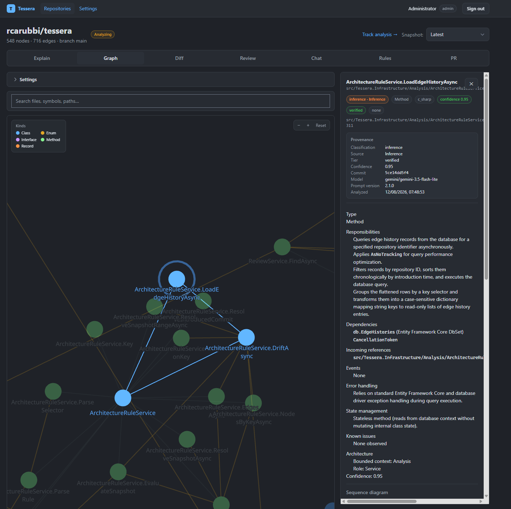

Every node carries an AI-generated Markdown description plus its exact source location. The AST is the ground truth — the AI summary is layered on top of it, never replacing it — so descriptions stay accurate even when semantics drift.

### 6. Diagram viewer

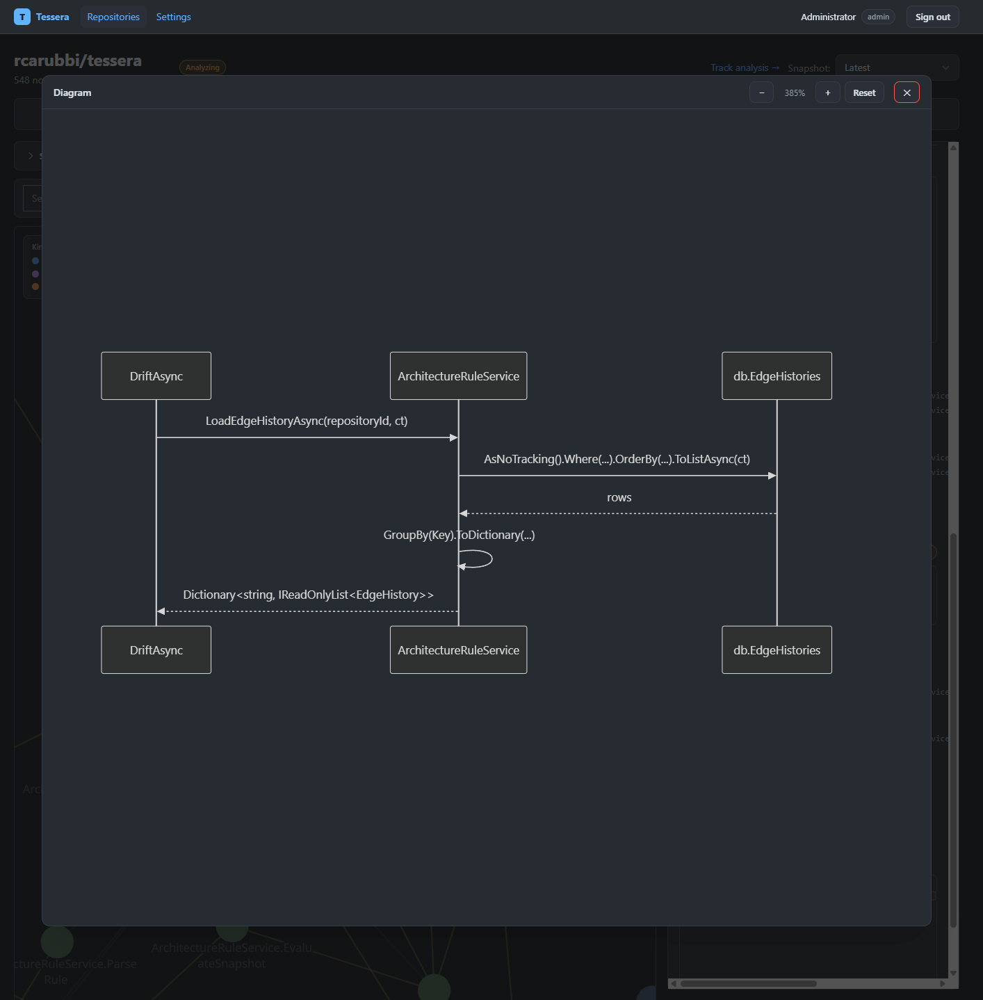

Render any subgraph as a Mermaid diagram directly in the browser. Follow the call chain of a method, trace a dependency path, and preview relationship chains before investigating deeper.

### 7. Architectural diff

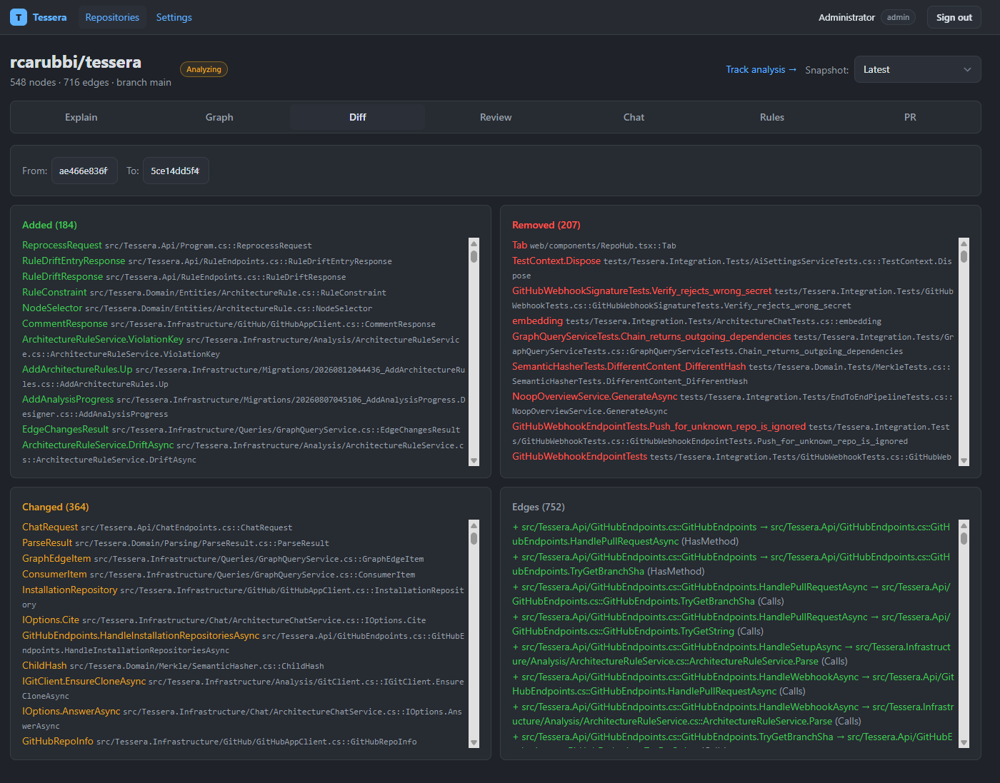

Compare two snapshots and get the architectural diff: which entities were added, changed or removed across commits, and which relationships shifted — the change impact at the architecture level, not just the file level.

### 8. Impact analysis

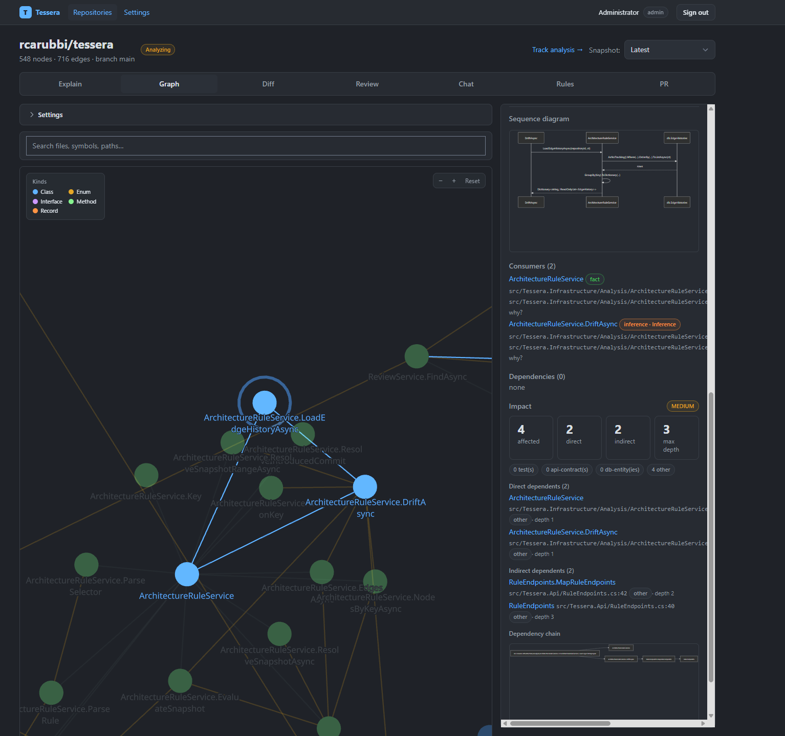

Answer **"what breaks if I change X?"**. Pick any entity and get a classified impact report (direct vs indirect dependencies, weighted by depth), a CRITICAL/HIGH/MEDIUM/LOW rating, and a Mermaid chain preview of the affected paths.

### 9. Pull request risk analysis

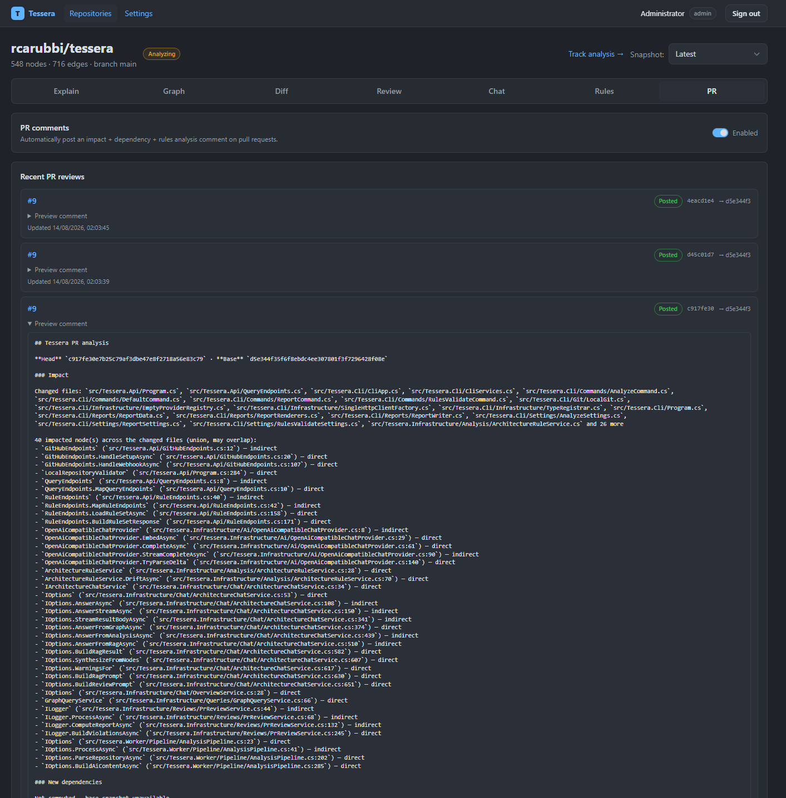

Ingest `pull_request` webhooks and score each PR against the knowledge graph: which architecture rules it would violate, which high-impact entities it touches, and an overall risk assessment — before the change lands.

### 10. Architecture rules

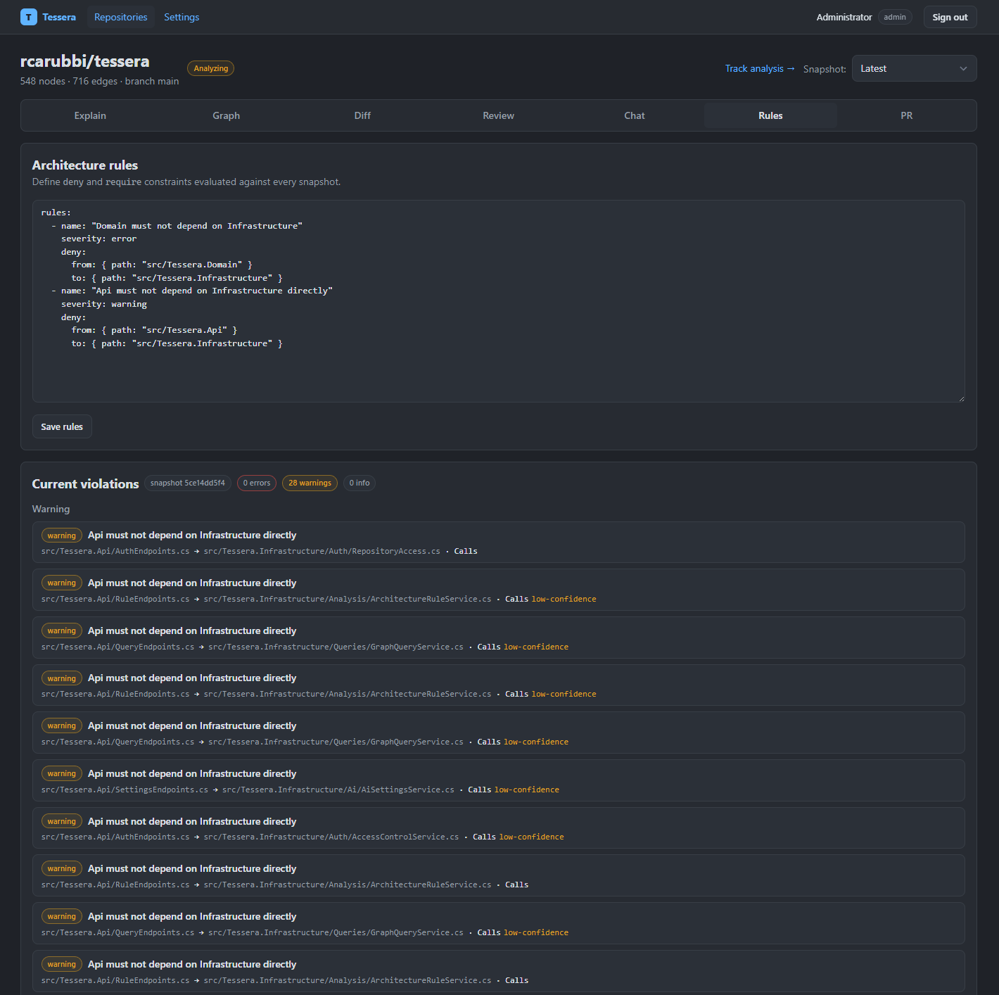

Enforce custom architecture rules (layering, dependency direction, forbidden calls) against the graph. Validate rules on the server or offline in CI with the CLI — the same rule engine, the same results.

### 11. RAG chat

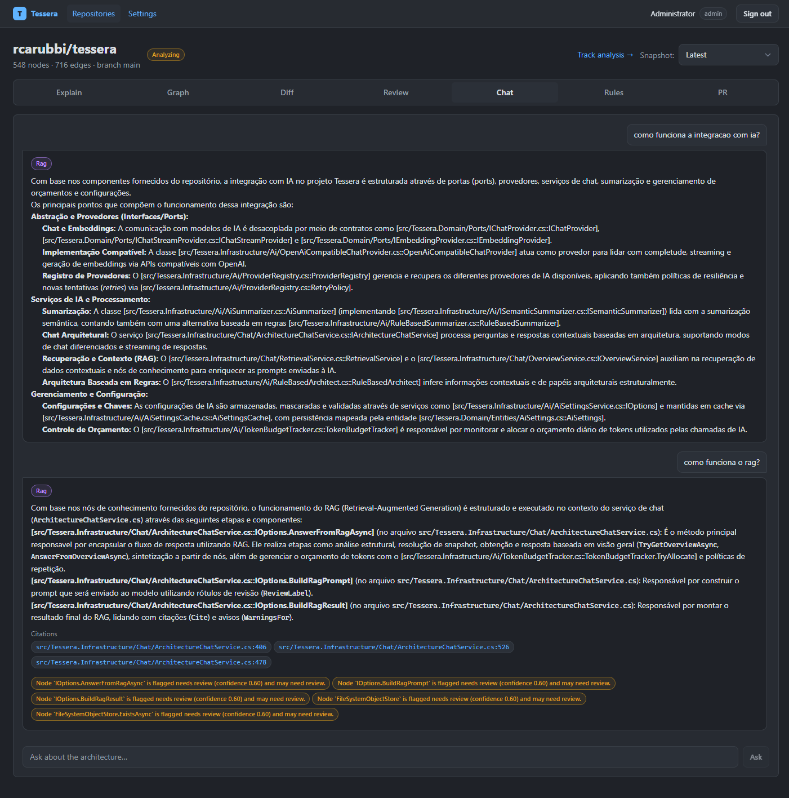

Chat with the codebase. Semantic retrieval over the knowledge graph (embeddings, with lexical fallback) answers questions with `file:line` citations, and a clear **NoContext** state when the corpus has nothing relevant.

## Installation

### Prerequisites

- Docker + Docker Compose
- Node.js 18+ (only for the Smee tunnel when testing local webhooks)
- A GitHub account (to create the GitHub App)
- An LLM API key (e.g. Gemini from https://aistudio.google.com/apikey)

### Quick start

```powershell
Copy-Item .env.example .env        # first time only, then fill in at least AUTH_ADMINS
docker compose up -d --build
```

Services:

| Service                         | URL                   |
| ------------------------------- | --------------------- |
| Dashboard                       | http://localhost:3000 |
| API                             | http://localhost:5080 |
| Analyzers (tree-sitter sidecar) | http://localhost:4350 |

The default dev access key is `dev-dashboard-key` — sign in at http://localhost:3000/login. Change `Dashboard__ApiKey` before any real use.

Then configure the LLM provider (**Settings > AI** — all stored in the database, no env vars or config files) and, for GitHub ingestion, create the GitHub App as described in [First-time setup](#first-time-setup).

For a full end-to-end walkthrough — GitHub App, webhook tunnel, OAuth and local repositories — see below.

### First-time setup

End-to-end walkthrough for a first local run: bring up the stack, connect the
LLM provider through the dashboard, and wire GitHub (ingestion webhook via
Smee + "Sign in with GitHub").

#### 1. Bring up the stack

```powershell
docker compose up -d --build
```

- Dashboard: http://localhost:3000
- API: http://localhost:5080
- Analyzers (tree-sitter sidecar): http://localhost:4350

#### 2. Configure the LLM (Settings > AI)

All provider details (name, base URL, model, API key, embedding model) are set
from the dashboard and stored in the database — **no environment variables or
config files**:

1. Sign in as an admin and open **Settings** (http://localhost:3000/settings).
2. Pick a provider preset (Google Gemini, OpenAI, OpenRouter, Ollama, Custom).
3. Confirm **Base URL** and **Model** (pre-filled by the preset).
4. Paste the **API key**.
5. Optionally set an **Embedding model** (for semantic RAG chat; defaults to
   the chat model).
6. **Save settings**.

Both the API and the worker pick up the change within seconds. Without a
configured provider Tessera runs in **structural-only mode** (AST ground truth,
no AI summaries).

#### 3. Create the GitHub App

The same App powers **ingestion** (clone + webhook) and **OAuth login**.

1. GitHub → **Settings → Developer settings → GitHub Apps → New GitHub App**.
2. Name and homepage URL.
3. **Webhook URL**: `https://smee.io/<your-channel>` (channel from step 4).
4. **Webhook secret**: generate one (e.g. `openssl rand -hex 20`) and note it.
5. **Permissions**: _Contents: Read_, _Metadata: Read_.
6. **Subscribe to events**: `push` (and `pull_request` for PR risk analysis).
7. **Setup URL**: `http://localhost:5080/api/github/setup` (where GitHub sends
   users after installing the App).
8. Create the App, then copy:
   - the **App ID**,
   - the **Client ID** and **Client secret** (App settings → OAuth), and
   - the **private key**: **Generate a private key**, download the `.pem`, and
     save it to `secrets/tessera-app.pem` (repo root; gitignored).

#### 4. Smee tunnel (local webhooks)

GitHub cannot reach `localhost`, so forward webhooks through Smee:

```powershell
npx smee-client --url https://smee.io/<your-channel> --target http://localhost:5080/api/github/webhook
```

Create a channel at https://smee.io (its URL is what you put in the App's
Webhook URL). Keep this terminal running while testing.

#### 5. Fill `.env` and restart

```powershell
Copy-Item .env.example .env   # first time only
```

Set at minimum:

| Key                          | Value                                             |
| ---------------------------- | ------------------------------------------------- |
| `GITHUB_APP_ID`              | GitHub App ID (integer)                           |
| `GITHUB_WEBHOOK_SECRET`      | The webhook secret from step 3                    |
| `GITHUB_OAUTH_CLIENT_ID`     | App Client ID                                     |
| `GITHUB_OAUTH_CLIENT_SECRET` | App Client secret                                 |
| `AUTH_ADMINS`                | Comma-separated GitHub logins that see every repo |

`.env` and `secrets/tessera-app.pem` are gitignored — never commit them. Apply
the environment changes:

```powershell
docker compose up -d --force-recreate api worker
```

#### 6. Install the App

1. GitHub App page → **Install App** → choose the account/repository.
2. GitHub redirects to the Setup URL; Tessera registers the repository and the
   dashboard opens with `?installed=1`.
3. Push a commit to an installed repo → the webhook (via Smee) triggers the
   worker → clone, parse, AI analysis, snapshot.

Force a re-analysis of already-connected repos:

```powershell
docker compose exec postgres psql -U tessera -d tessera -c "UPDATE \"Repositories\" SET \"Status\" = 0;"
```

#### 7. Sign in with GitHub

On the login page use **Sign in with GitHub** — OAuth redirects back to the
dashboard. Logins in `AUTH_ADMINS` see every repository; other users see only
the repos their installations cover.

## Local (offline) repositories

Tessera can also analyze a git repository that lives on the same machine — no
GitHub App, no webhook, no push trigger. Analysis runs **only when you ask**.

The worker runs inside a container, so the repository must be mounted into it
first. There is **one** mount, a parent directory — not one per repo. Drop any
repo folder into `repos/` on the host and it becomes visible to the worker at
`/repos/local/<folder>`. No `docker-compose.yml` edits needed. The path is
`${LOCAL_REPOS_DIR:-./repos}` so it can be overridden in `.env`:

```yaml
# worker service (already in docker-compose.yml)
volumes:
  - ${LOCAL_REPOS_DIR:-./repos}:/repos/local:ro
```

then:

1. Put a git repo folder under `repos/`, e.g. `repos/MyApp/`.
2. Open **Repositories** and click **Add local repository**.
3. Enter a **Name** (`[A-Za-z0-9._-]`, used as the clone folder), the **path
   inside the worker** (e.g. `/repos/local/MyApp`), and the default branch.
4. **Add** — the card shows a `local` tag and stays inactive.
5. Click **Analyze →** to queue the first full analysis; re-runs use the
   **Reprocess** controls on the repository's progress screen.

Local repositories are visible to the user who added them and to admins. A bad
mount path only surfaces when the worker tries to clone (the repo card shows
the failure). Without a configured LLM provider the run is structural-only,
same as GitHub repositories.

## Offline CLI

`Tessera.Cli` ships a `tessera` console binary that runs the same parse →
rule-based summarize → link → graph pipeline the worker runs, but fully
offline: no database, no API, no AI provider, no upload. It needs only the
.NET runtime, git, and the analyzer sidecar (for multi-language parsing).
Output lands in a `tessera-report/` folder with Markdown + JSON artifacts.

Arguments, options, and help are handled by [Spectre.Console.Cli](https://spectreconsole.net/cli/), and the terminal UI (banner, spinners,
progress bars, summary/violation tables) is rendered with Spectre.Console.

Build and run:

```powershell
dotnet build src/Tessera.Cli/Tessera.Cli.csproj
dotnet run --project src/Tessera.Cli -- analyze /path/to/repo
dotnet run --project src/Tessera.Cli -- --help
```

Parsing requires the analyzer sidecar (default `http://localhost:4350`, override
with `--analyzer-url <url>`). Start it locally, or reuse the docker one — the
`analyzers` service publishes `127.0.0.1:4350`:

```powershell
# in analyzers/
npm install
npm run dev
```

Commands:

| Command                                     | Purpose                                                                                               |
| ------------------------------------------- | ----------------------------------------------------------------------------------------------------- |
| `tessera analyze [path]`                    | Parse the repo at HEAD, write Markdown + JSON reports; `-o/--output <dir>` and `--analyzer-url <url>` |
| `tessera report [dir]`                      | Regenerate the Markdown reports from an existing `report.json`                                        |
| `tessera rules validate <rules.yaml> [dir]` | Evaluate architecture rules against the report graph                                                  |

Exit codes: `0` success, `1` rule violation, `2` usage/parse error, `3`
sidecar/IO failure. Bare `tessera` (no command) and unknown commands exit `2`
after showing usage.

`report` and `rules validate` do not need the sidecar — they only read
`report.json`, so they are CI-friendly. Rules reuse the server's rule engine
(`ArchitectureRuleService.Parse` / `Evaluate`) and impact/cycle/top-dependency
computations reuse the shared `GraphAlgorithms` helpers, so CLI results match
the dashboard for the same snapshot.

## Stack

- Backend: ASP.NET Core (.NET 10), EF Core + PostgreSQL
- Parse: web-tree-sitter (C#, Java, JS/TS, Python, Go, PHP, Ruby)
- Object store: filesystem (dev) → S3-compatible (prod)
- LLM: OpenAI-compatible providers (Gemini, DeepSeek/Qwen/GLM) via `IChatProvider`

## Development

```powershell
docker compose up -d postgres analyzers
dotnet run --project src/Tessera.Api
dotnet run --project src/Tessera.Worker

# dashboard
docker compose up -d web   # http://localhost:3000 (access key: Dashboard__ApiKey)
cd web; npm run dev        # or dev mode

# tests
dotnet test
cd analyzers; npm test
cd web; npm run typecheck
./tools/scan-secrets.ps1        # secrets scan
./tools/cost-estimate.ps1       # LLM cost benchmark (requires a running API)
```

Deployment and configuration (envs, LLM providers, GitHub App, hardening):
[`DEPLOYMENT.md`](DEPLOYMENT.md).
